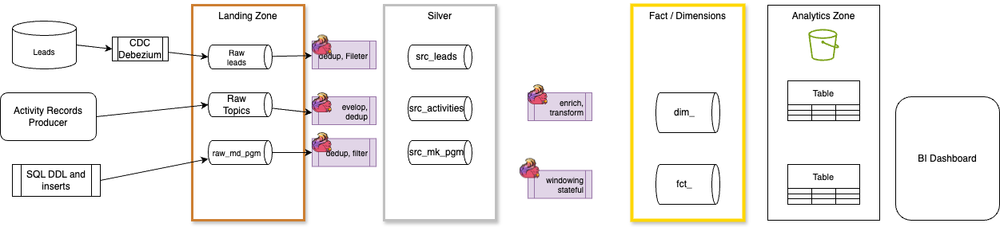
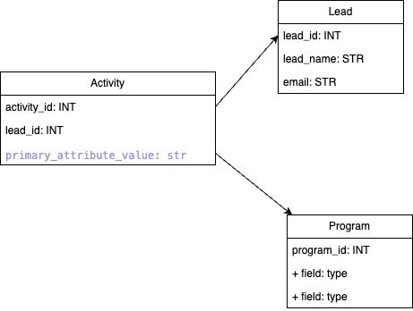
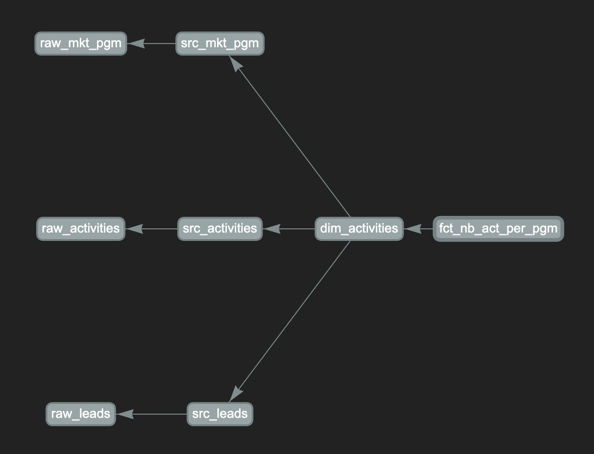
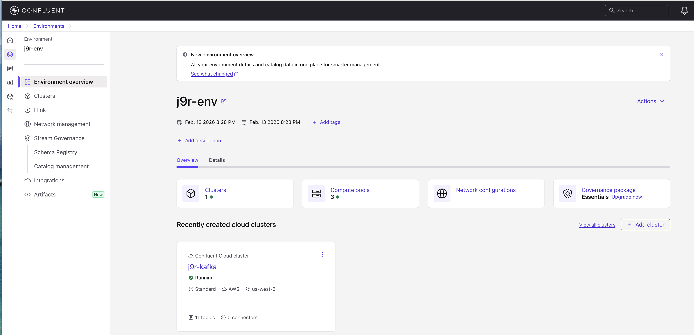
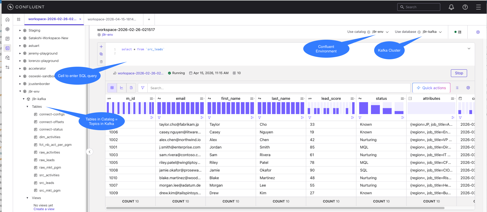
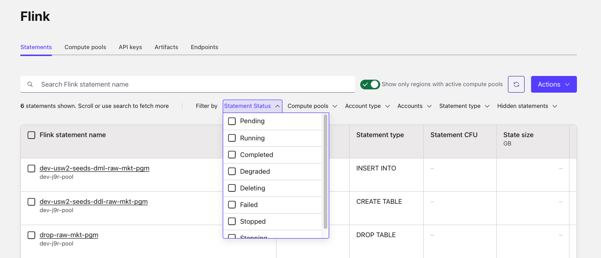
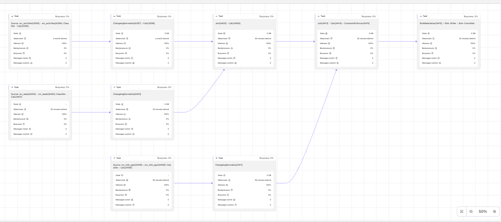
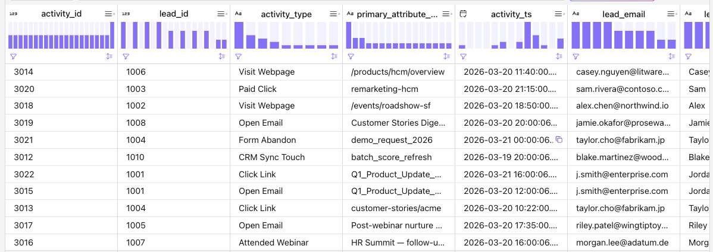
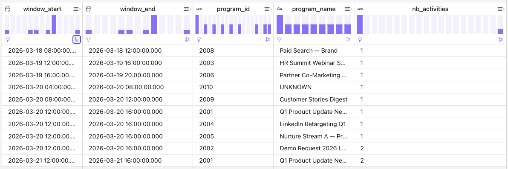
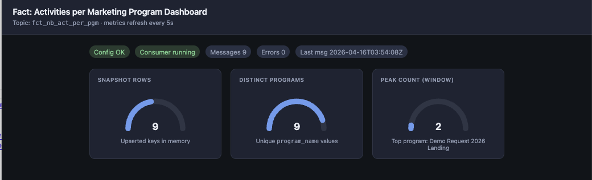

# A simple Confluent Cloud Flink SQL demonstration for marketing campaign processing

## Scope

* Process leads for marketing campaigns. Raw data include lead, activities, like clicks, open-email...
* There are multiple feeds of data to get lead information.

* A lead is the primary business identity. This class handles the core user's profile and custom attributes. m_id is the primary key
* The  data feeds are often just a long stream of activities (Email Opens, Web Visits, Form Fills). The `ActivityRecord` captures the "What" and "When.". It references a lead, while the primary key is a activity_id

Here is a simple figure of the pipeline architecture:




### Demonstration

The demonstration addresses the following standard patterns of data processing:

* How to process schemaless topic as raw of byte (JSON payload)
* How to process CDC records with Debezium envelop
* Deduplication, filtering logic to create bronze layer
* Build dimension for activities enriched with leads information and program information
* Build a fact for marketing program or activity tracking.

## Feature status

* [ ] From the domain classes defined in `model.py` we can develop kafka producer for activities and consumers for fact tables
* [x] Raw tables are created in pipelines/raw for the 3 tables:
    * [x] Leads is a CDC Debezium envelop.
    * [x] Marketing Program is a schemaless with payload-json field,
    * [x] raw_activities record is a table with typed columns. For each table few insert statements are done to get useful data.

    

* [x] src_* tables created as bronze layer to dedup, filter and transform raw data.
* [x] Develop dimension about activities with leads and marketing program information
* [x] Fact to compute the number of activities per program to see the most actives program

### SQL Status

| Name | DDL | DML |
| --- | --- | --- |
| raw_mkt_pgm | completed | inserts | 
| src_mkt_pgm | completed | run |
| raw_leads | completed | inserts |
| src_leads | completed | run |
| raw_activities | completed | inserts |
| src_activities | completed | run |
| dim_activities | completed | run |
| fct_nb_act_per_pgm |completed | run |



*The current structure of flink statements can be adapted, as when there is only one consumer of a flink statement, it is recommended to build it as CTE*.

## Demonstration

### Understanding main concepts

* [See main Flink Concepts sunmmary](https://jbcodeforce.github.io/flink-studies/concepts/)
* Confluent Cloud Flink [concepts and lab](https://github.com/griga23/flink-workshop/blob/main/lab1.md)

Review following items in the Confluent Cloud Concepts:

1. Confluent Environment
  

1. Flink Workspace, Catalog(Environment) and Database (Kafka Cluster)
  

1. Flink Statements, filtering based on status
  

1. Review execution plan of a DAG using [EXPLAIN](https://docs.confluent.io/cloud/current/flink/reference/statements/explain.html)
  ```sh
  StreamSink [10]
  +- StreamCalc [9]
    +- StreamGlobalWindowAggregate [8]
      +- StreamExchange [7]
        +- StreamLocalWindowAggregate [6]
          +- StreamCalc [5]
            +- StreamChangelogNormalize [4]
              +- StreamExchange [3]
                +- StreamCalc [2]
                  +- StreamTableSourceScan [1]
  ```

1. We can also look at the query profiler
  

### Review the raw_mkt_pgm as schemaless

The unique field is a json string as payload (See [raw_mkt_pgm](https://github.com/jbcodeforce/wd-flink-demo/blob/main/pipelines/raw/raw_mkt_pgm/sql-scripts/ddl.raw_mkt_pgm.sql)).

```sql
CREATE TABLE IF NOT EXISTS `raw_mkt_pgm` (
  `payload` VARCHAR(2147483647) NOT NULL
) 
WITH (
  'changelog.mode' = 'append',
  ...
```

 The payload is a json object which can be transformed to new columns. See [dml.src_mkt_pgm.sql](https://github.com/jbcodeforce/wd-flink-demo/blob/main/pipelines/ldg/src_mkt_pgm/sql-scripts/dml.src_mkt_pgm.sql)

 ```sql
select
    json_value(payload, '$.program_id') as program_id,
    json_value(payload, '$.name') as name,
    json_value(payload, '$.channel') as channel,
    json_value(payload, '$.status') as status,
    json_value(payload, '$.workspace') as workspace,
    `$rowtime` as event_ts
  from raw_mkt_pgm where payload IS NOT NULL
  ...
 ```

 [See JSON built-in functions](https://nightlies.apache.org/flink/flink-docs-stable/docs/dev/table/functions/systemfunctions/#json-functions) and [from Confluent documentation.](https://docs.confluent.io/cloud/current/flink/reference/functions/json-functions.html)


### Review CDC Debezium envelops

The raw_leads is defined as a table/schema created by Debezium. For this demonstration there is no source table in SQL database, but a mock of what the schema looks like. For real CDC Debezium outcome see the demonstration [healthcare-shift-left-demo Kafka Connect](https://github.com/jbcodeforce/healthcare-shift-left-demo/tree/main/connect) or []().


```sql
CREATE TABLE IF NOT EXISTS raw_leads (
  `m_id`         STRING NOT NULL COMMENT 'Source primary key (from Debezium key)',
  `before`       STRING COMMENT 'Row state before change (JSON); null for INSERT',
  `after`        STRING COMMENT 'Row state after change (JSON); null for DELETE',
  `op`           STRING COMMENT 'Debezium op: c=create, u=update, d=delete, r=read/snapshot',
  `source_ts_ms` BIGINT COMMENT 'Source event timestamp (ms)',
  PRIMARY KEY (`m_id`) NOT ENFORCED
) DISTRIBUTED BY HASH(`m_id`) INTO 3 BUCKETS
```

From this table definition, the source processing handles data extraction, deduplication via upsert and filtering in the [dml.src_leads.sql](https://github.com/jbcodeforce/wd-flink-demo/blob/main/pipelines/ldg/src_leads/sql-scripts/dml.src_leads.sql)

### Build dimension

* Left joins and limit on state size: left table is the activities as it is a high-velocity stream.
  ```sql
  INSERT INTO dim_activities
  with activities_leads as (
    ...
    FROM src_activities sa
    LEFT JOIN src_leads ON sa.lead_id = src_leads.m_id
  )
  SELECT
     ...
  FROM activities_leads al
  left JOIN src_mkt_pgm p ON al.program_id = p.program_id
  WHERE p.status <> 'Draft'
  ```

Here is an example of reported values:



### Fact: number of activities per program

Most of streaming processing use time window to compute analytics aggregates. Here is a simple example of computing the number of activities per program over 4 hours time windows.

```sql
-- Daily tumbling windows (event time on activity_ts): distinct activities per program per day.
INSERT INTO fct_nb_act_per_pgm
SELECT
  window_start,
  window_end,
  program_id,
  COALESCE(program_name, 'UNKNOWN') AS program_name,
  COUNT(DISTINCT activity_id) AS nb_activities
FROM TABLE(
  TUMBLE(
    TABLE dim_activities,
    DESCRIPTOR(activity_ts),
    INTERVAL '4' HOURS
  )
)
GROUP BY
  window_start,
  window_end,
  program_id,
  COALESCE(program_name, 'UNKNOWN');

```

* Watermark is an important elements for time windows based. We recommend [this video](https://docs.confluent.io/cloud/current/flink/concepts/timely-stream-processing.html) and [this summary](https://jbcodeforce.github.io/flink-studies/concepts/#watermarks).


For the fact table, the watermark is roughly max `activity_ts` seen so far, minus 5 seconds. A 4-hour tumbling window (start, end) is considered complete and emits only when the watermark is ≥ end.  The watermark cannot move past time T if every event has activity_ts ≤ T.


Below is an example of fact data:



### Consumer from kafka topics

The consumer is a FastAPI that exposes a metrics api, and a simple dashboard. The WebApp polls every 5 seconds the metrics api, while the backend starts a Kafka Consumer to get new records from the fact table.




### Deploy

* Using shift_left
  ```sh
  source set_sl_env
  shift_left table build-inventory
  shift_left pipeline build-all-metadata
  shift_left pipeline deploy --table-name fct_nb_act_per_pgm --compute-pool-id $SL_FLINK_COMPUTE_POOL_ID
  ```

* Using dbt

### Undeploy

* Using shift_left
  ```sh
  shift_left pipeline undeploy --table-name fct_nb_act_per_pgm --compute-pool-id $SL_FLINK_COMPUTE_POOL_ID
  ```